# mem

**Personal LLM memory for Cline (VS Code)** · 给 Cline 的个人 LLM 记忆系统

[English](#english) · [中文](#中文)



---

## English

### What it does

mem records every Cline conversation, keeps the raw data locally, distills durable
taste / preferences / procedures, and injects a fixed-structure memory block into
future prompts. One person owns one local store. No account, no cloud database.

### Features

- **Capture** — Cline hooks + background daemon; raw JSONL, full transcripts,
  content-addressed blobs for large tool output, PreCompact archives.
- **Retrieval** — SQLite FTS5, CJK segmented index, optional embedding rerank.
- **Injection** — fixed `<memory>` block (taste / preferences / pitfalls /
  project / facts / procedures / cards / past) with a configurable budget.
- **Taste** — LLM distillation → candidates → manual review → active profile,
  with versioned `TASTE.md` snapshots.
- **Skills** — repeated procedures crystallize into `SKILL.md` files under
  `~/.cline/skills`, with outcome tracking.
- **Sources** — Cline, Codex CLI, generic JSONL.
- **Privacy** — local-only store, secret scan/redact, per-task off switch
  (`@nomem`, `memctl off <taskId>`), `mem_forget` with re-ingest denylist.
- **Ops** — MCP tools, metrics/report, export/import, full TUI, one-click
  installers for macOS, Linux and Windows.

### Architecture

```text
Cline hooks ─▶ raw store ─▶ daemon ─▶ SQLite ─▶ distill ─▶ review ─▶ memory block ─▶ next prompt
             (JSONL/blobs)          (sessions/cards/units/injections)   (active units)
```

### Quick start

macOS / Linux:

```bash
curl -fsSL https://raw.githubusercontent.com/acshameless/mem/main/install.sh \
  | MEM_REPO_URL=https://github.com/acshameless/mem.git bash
```

Windows (PowerShell):

```powershell
$env:MEM_PACKAGE_URL = 'https://github.com/acshameless/mem/archive/refs/heads/main.zip'
irm https://raw.githubusercontent.com/acshameless/mem/main/install.ps1 | iex
```

From source:

```bash
git clone https://github.com/acshameless/mem.git ~/Github/mem
cd ~/Github/mem && bash install.sh
```

The installer checks or installs Node 24, installs the `memctl` / `memd` CLI,
configures the model key, installs hooks and the MCP server, and starts the
daemon (launchd on macOS, systemd user units on Linux, Task Scheduler on
Windows). Re-running the same command upgrades in place.

### TUI

```bash
memctl tui            # full app
memctl tui --review   # review only
```

| # | Screen | Actions |
|---|---|---|
| 1 | Dashboard | read-only overview |
| 2 | Sessions | `d` distill, `f` forget |
| 3 | Search | `/` query |
| 4 | Candidates | `a` approve, `r` reject, `e` edit, `p` pin, `f` forget |
| 5 | Active | `r` retire, `p/u` pin, `e` edit, `f` forget |
| 6 | Skills | `n` draft, `a` activate, `r` reject, `o/x` outcome |
| 7 | Tasks | `m` memory, `c` capture, `i` add task |
| 8 | Metrics | read-only |
| 9 | Config | `a` auto-distill, `e` quiet window, `x` export, `i` import, `s` scan |

Keys: `1-9` / `Tab` switch, `j/k` move, `Enter` submit, `Esc` cancel, `q` quit.

### Docs

- [Feature inventory](docs/features.md)
- [Architecture & internals](docs/architecture.md)
- [Hooks & skills channels](docs/hooks.md)
- [Hook completeness audit](docs/hooks-audit.md)
- [Manual acceptance checklist](docs/manual-acceptance.md)
- [Data model](docs/data-model.md)
- [CLI reference](docs/cli.md)
- [MCP tools](docs/mcp.md)
- [TUI reference](docs/tui.md)
- [Development guide](docs/development.md)
- [Embedding providers](docs/embedding.md) (local EmbeddingGemma first;
  Google Gemini / Vertex / OpenAI-compatible optional)
- [One-click deployment](docs/one-click.md)
- [Operations runbook](docs/operations.md)
- [Windows guide](docs/windows.md)
- [Windows deploy & verify](docs/windows-deploy.md)
- [Phase 0 hook contract](docs/phase0-contract.md)

### Development

```bash
npm test          # 35 tests, Node 24, no dependencies
bash scripts/package.sh
git tag v0.4.0 && git push origin v0.4.0   # triggers the release workflow
```

---

## 中文

### 它做什么

mem 记录你和 Cline 的全部对话，把原始数据保存在本地，蒸馏出可复用的
沟通偏好 / 工作习惯 / 流程，并在之后的对话里注入固定结构的记忆块。
一个人一份本地存储，不需要账号，不使用云端数据库。

### 功能

- **采集**：Cline hooks + 后台 daemon；原始 JSONL、完整会话、大工具输出走
  blob 存储、PreCompact 压缩前归档。
- **检索**：SQLite FTS5 + 中文分段索引，可选 embedding 重排。
- **注入**：固定结构 `<memory>` 块（taste / preferences / pitfalls /
  project / facts / procedures / cards / past），预算可配置。
- **Taste**：LLM 蒸馏 → 候选 → 人工审核 → 激活，profile 以 `TASTE.md`
  版本化保存。
- **技能结晶**：重复出现的流程生成 `SKILL.md`，安装到 `~/.cline/skills`，
  并记录成功/失败成效。
- **来源**：Cline、Codex CLI、通用 JSONL。
- **隐私**：本地存储、密钥扫描与清除、单任务关闭（`@nomem`、
  `memctl off <taskId>`）、`mem_forget` 删除并防止重新摄入。
- **运维**：MCP 工具、指标与周报、导出/导入、全功能 TUI、
  macOS / Linux / Windows 一键部署。

### 架构

```text
Cline hooks ─▶ 原始存储 ─▶ daemon ─▶ SQLite ─▶ 蒸馏 ─▶ 审核 ─▶ 记忆块 ─▶ 下一次对话
             (JSONL/blob)        (sessions/cards/units/injections) (active units)
```

### 快速开始

macOS / Linux：

```bash
curl -fsSL https://raw.githubusercontent.com/acshameless/mem/main/install.sh \
  | MEM_REPO_URL=https://github.com/acshameless/mem.git bash
```

Windows（PowerShell）：

```powershell
$env:MEM_PACKAGE_URL = 'https://github.com/acshameless/mem/archive/refs/heads/main.zip'
irm https://raw.githubusercontent.com/acshameless/mem/main/install.ps1 | iex
```

源码安装：

```bash
git clone https://github.com/acshameless/mem.git ~/Github/mem
cd ~/Github/mem && bash install.sh
```

安装脚本会检查或安装 Node 24、安装 `memctl` / `memd` 命令、配置模型 key、
安装 hooks 与 MCP、启动后台服务（macOS 用 launchd、Linux 用 systemd user、
Windows 用计划任务）。重复执行同一条命令即可原地升级。

### TUI

```bash
memctl tui            # 完整应用
memctl tui --review   # 只看候选审核
```

| # | 屏幕 | 操作 |
|---|---|---|
| 1 | Dashboard | 只读概览 |
| 2 | Sessions | `d` 蒸馏、`f` 删除 |
| 3 | Search | `/` 输入查询 |
| 4 | Candidates | `a` 通过、`r` 拒绝、`e` 编辑、`p` 置顶、`f` 忘记 |
| 5 | Active | `r` 退休、`p/u` 置顶、`e` 编辑、`f` 忘记 |
| 6 | Skills | `n` 生成、`a` 激活、`r` 拒绝、`o/x` 成效 |
| 7 | Tasks | `m` memory、`c` capture、`i` 添加任务 |
| 8 | Metrics | 只读 |
| 9 | Config | `a` 自动蒸馏、`e` 静默窗口、`x` 导出、`i` 导入、`s` 密钥扫描 |

按键：`1-9` / `Tab` 切屏，`j/k` 移动，`Enter` 提交，`Esc` 取消，`q` 退出。

### 文档

- [功能总览](docs/features.md)
- [架构与内部机制](docs/architecture.md)
- [Hook 全覆盖与技能通道](docs/hooks.md)
- [Hook 完备性审计](docs/hooks-audit.md)
- [真实环境手工验收清单](docs/manual-acceptance.md)
- [数据模型](docs/data-model.md)
- [CLI 参考](docs/cli.md)
- [MCP 工具](docs/mcp.md)
- [TUI 参考](docs/tui.md)
- [开发指南](docs/development.md)
- [Embedding 供应商](docs/embedding.md)（本地 EmbeddingGemma 优先；
  Google Gemini / Vertex / OpenAI 兼容为可选项）
- [一键部署](docs/one-click.md)
- [运维手册](docs/operations.md)
- [Windows 指南](docs/windows.md)
- [Windows 部署验证](docs/windows-deploy.md)
- [Phase 0 hook 合约](docs/phase0-contract.md)

### 开发

```bash
npm test          # 35 项测试，Node 24，零依赖
bash scripts/package.sh
git tag v0.4.0 && git push origin v0.4.0   # 触发发布工作流
```
